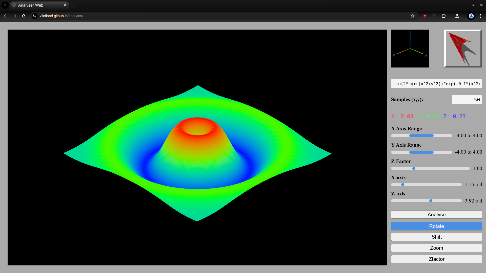
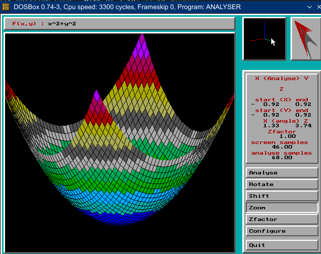

# Analyser Web Application

This project is a remake of an old DOS-based application that graphically renders 3D mathematical functions. The original application was inspired by a high school math teacher's inability to visualize formulas graphically. It took approximately six weeks to complete.

With the advancements in AI development, I decided to recreate the application to measure productivity gains. The remake took about two weeks of part-time work. Initially, I attempted to have AI analyze the old code, plan the migration to modern technology, and build the new project. However, this approach resulted in significant redundancy and required extensive refactoring.

Ultimately, I purged the AI-generated code and redesigned the UI and rendering layer using small, instructive prompts, which proved to be a more effective approach.

## Usage

The application is hosted on GitHub Pages and can be accessed [here](https://vlietland.github.io/analyser/) It can be used freely and may be beneficial for teachers and students.

To use the application, copy-paste a mathematical formula, and it will be rendered in 3D. Here are some example formulas to try:
- sin(sqrt(x^2 + y^2))
- sin(x) * cos(y)
- sin(5 * sqrt(x^2 + y^2)) / sqrt(x^2 + y^2)
- x^2 - y^2
- (x^2 + y^2) * cos(x^2 + y^2)
- sin(x^2 - y^2)
- sqrt(1 - (x/2)^2 - (y/2)^2)

After rendering you can rotate, shift the range, zoom the range and limit use Zfactor to cushion the z-axis.

## Documentation

For details on the architecture of the new Analyser Web application, see the [analyserWeb documentation](./analyserWeb/docs/analyserWeb).

For more information about the old Analyser application, see the [legacy code documentation](./analyserWeb/docs/legacyCode).

## EyeCandy
Analyser:

Legacy Analyser:

## License

This project is licensed under the GNU General Public License Version 3. See the [LICENSE](./LICENSE) file for details.

Copyright (C) 2025 Jan Vlietland
