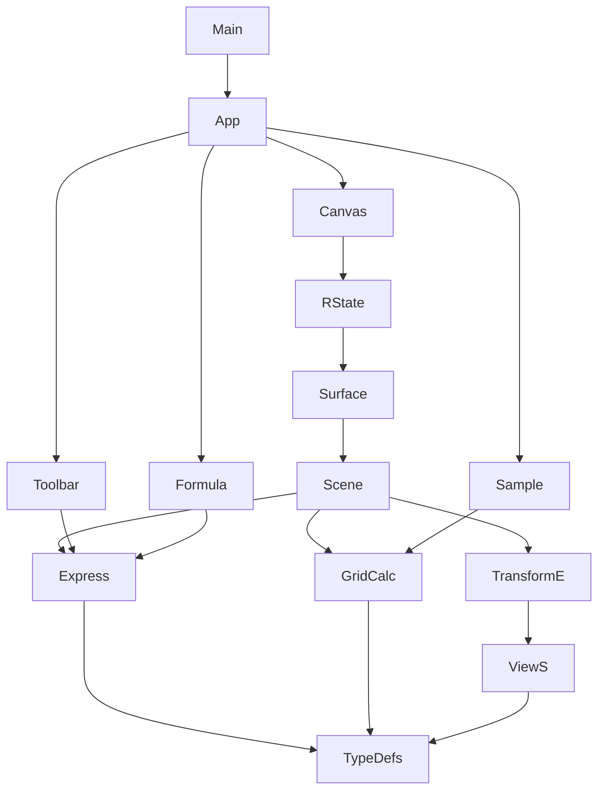

# Analyser Web Application Structure

This document outlines the high-level structure and dependencies of the `analyserWeb` application.

## Mermaid Diagram

The following diagram visualizes the main components and their interactions:

## Layers

*   **UI Layer (`src/ui`)**: Contains React components responsible for the user interface, including the main application layout (`App.tsx`), toolbar, canvas viewport, formula input, and sample selector. It interacts with both the Renderer and Core layers.
*   **Renderer Layer (`src/renderer`)**: Handles the rendering logic, likely using WebGL or a similar technology via the `CanvasViewport`. It manages the rendering state, builds the scene, and renders surfaces based on data from the Core layer.
*   **Core Layer (`src/core`)**: Encapsulates the application's business logic, including expression evaluation, grid calculations, and coordinate transformations. It provides data and functionality to the UI and Renderer layers.
*   **Entry Point (`src/main.tsx`)**: Initializes the React application and mounts the root `App` component.
